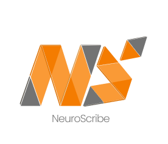

<h1 align="center"> NeuroScribe v0.2.0 </h1>

<div align="center">
    <picture>
        
    </picture>
</div>

## Installation

```
> pip install neuro-scribe
```

> [!Note]
>
> - If you want CUDA support for GPU acceleration, please ensure that you have CUDA Toolkit version 12 or higher installed on your device.<br> You can download CUDA Toolkit from the official NVIDIA website: [CUDA Toolkit Downloads](https://developer.nvidia.com/cuda-downloads)

## Quick Start Example

This example demonstrates how to use Neuroscribe in a way that closely resembles PyTorch syntax and conventions. By following PyTorch's familiar patterns, users can easily integrate Neuroscribe into their existing deep learning workflows without significant adjustments.

```python
import neuroscribe as ns
import neuroscribe.nn as nn


class MyModel(nn.Module):
    def __init__(self):
        super().__init__()
        self.l1 = nn.Linear(784, 128)
        self.relu = nn.ReLU()
        self.l2 = nn.Linear(128, 10)

    def forward(self, x):
        x = self.l1(x)
        x = self.relu(x)
        x = self.l2(x)
        return x


def main():
    model = MyModel()
    model.eval()
    model.to('cuda')
    input = ns.randn(32, 784, dtype='float32', requires_grad=False, device='cuda')
    output = model(input)
    print(output)


if __name__ == '__main__':
    main()
```

## Available Accelerators

Neuroscribe currently supports the following accelerators:

- CPU (default)
- CUDA

We plan to add support for additional accelerators to further enhance performance capabilities.

## Notes

- Functions suffixed with '\_' in the Tensor class perform in-place modifications to the Tensor object and do not create a new Tensor as output.
